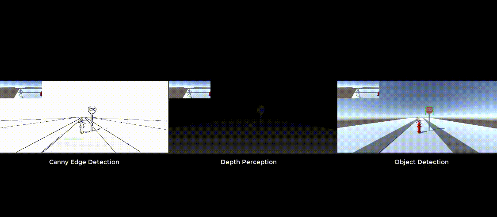
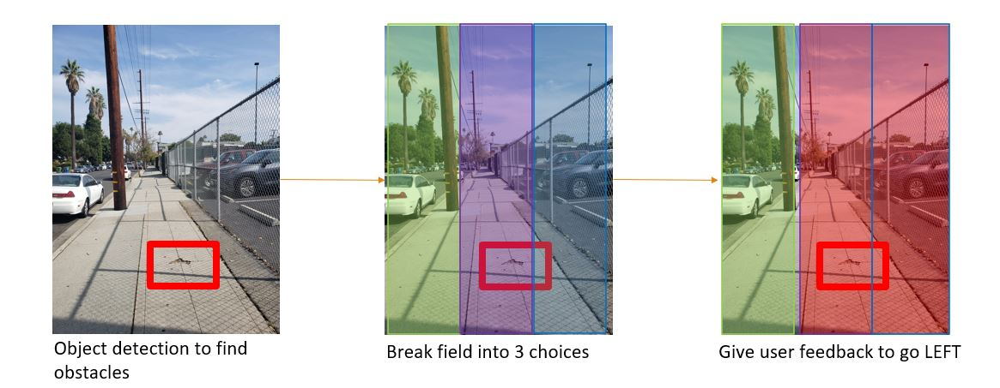
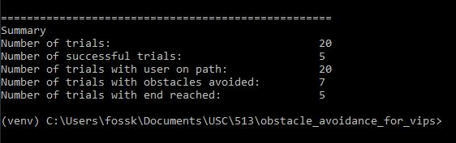

# Simulated Navigational Assistance Device for Visually Impaired Persons
**Authors:** Katie Foss and Advait Rane
### Table of Contents:
1. [Project Summary](#ProjectSummary)
2. [Simulation Runs](#SimulationRuns)
3. [Architecture Diagram](#ArchitectureDiagram)
4. [Developer Setup](#DeveloperSetup)
5. [References](#References)

### Project Summary
#### Abstract
A visually impaired person or (VIP) can use a walking cane, or even a smart cane to help them
complete navigational tasks in their day to day lives. However, current devices on the market only tell a user an obstacle
is ahead, not how to avoid the obstacle. We present a simulated wearable device that communicates to a user what 
direction to walk to avoid an obstacle. We evaluate the wearable device against STL safety requirements.

#### Problem Statement
Navigate a user down a straight sidewalk, avoiding the following obstacles at ground and head height:
1. Fire Hydrant (at ground level)
2. Stop Sign (at head level)
3. Bicycle (larger obstacle at ground level)

#### Proposed Solution
Simulated wearable device with RGB-D camera to direct a VIP to go {Straight, Left, Right, Stop}. 
The RGB-D camera is used to perceive the edge of the sidewalk, obstacles and the depth of the obstacle from the user.
The edge of the sidewalk is detected using Canny Edge Detection, an obstacle detected with a pretrained YOLO convolutional neural network [2], 
and depth detected from the RGB-D camera.

Environment Perception:

The perceived environment is then used to determine which walking lane is clear, following the approach written by Lin B-S et. al [1].
The camera feed is split into three lanes and the clear lane is chosen to proceed.

### Simulation Runs
Successful Runs: 

Unsuccessful Runs: 

### Architecture Diagram

### Developer Setup

Install the following software:

| Software |Version| Description                                                                                                                                                                            |
|----------|---|----------------------------------------------------------------------------------------------------------------------------------------------------------------------------------------|
| Unity    | 2022.10a16| The pre-release gives the project access to *Unity for Python*, although Unity for Python isn't necessary at this time, it could be used in the future to do real time STL evaluation. |
| Python3  |3.8.0| Used for STL evaluation.                                                                                                                                                               |

##### Instructions:
1. Open this project in Unity
2. Open the scene `Assets/Scenes/FixedDepthSimulation.unity`
3. To run the simulation, click Play, n series of episodes will play
4. Run `evaluate_stl.py` after n simulation runs for STl requirement evaluations.

#### Sample STL Output

### References
1. Lin, B.-S., Lee, C.-C., & Chiang, P.-Y. (2017). Simple Smartphone-Based Guiding System for Visually Impaired People. In Sensors (Vol. 17, Issue 6, p. 1371). MDPI AG. https://doi.org/10.3390/s17061371
2. Onnx. (n.d.). Onnx/models: A collection of pre-trained, state-of-the-art models in the ONNX format. GitHub. Retrieved November 12, 2021, from https://github.com/onnx/models#object_detection. 

